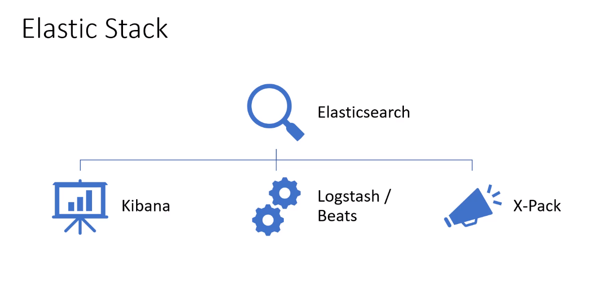
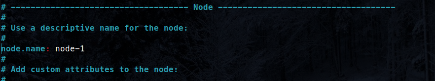
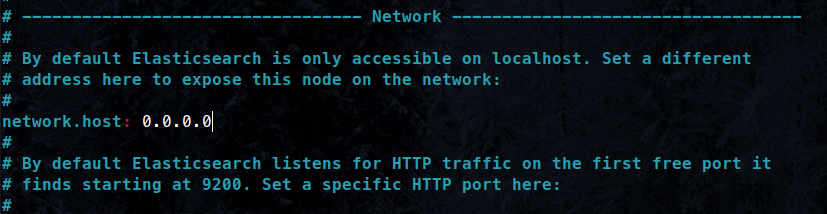
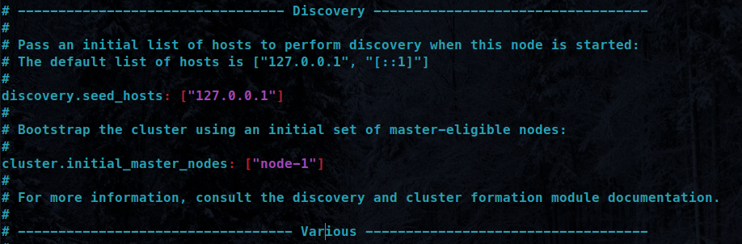

# **ElasticStack Study**



# **Como Utilizar**

Iniciar o container do Ubuntu com o Elasticsearch, utilize o comando:

```bash
make up
```

Para deletar todos os containers, utilize o comando:

```bash
make down
```

Para pausar o container sem destruir, utilize o conmando:

```bash
make stop
```

Caso você precise "re-buildar" o container, pode utilizar o comando:

```bash
make build
```


# **Configurações**

## Configurações do Host

Vamos definir o número máximo de memória na nossa máquina.

PS: Esse comando é para ser executado **na sua máquina** e não dentro do **container**!
```bash
sudo sysctl -w vm.max_map_count=262144
```

* Será necessário executar esse comando todas as vezes que você "reiniciar" o Host. Caso queira deixar esse valor setado permanentemente, siga os comandos:

Abra o arquivo de configurações:

```bash
sudo vim /etc/sysctl.conf
```

Adicione a linha:

```
vm.max_map_count=262144
```

Depois, reinicie as configurações para ser aplicado:

```
sudo sysctl -p
```


## Configurações do Container

Agora vamos fazer as configurações do container.

### Configuração do arquivo elasticsearch.yml

Quando você estiver no container `ubuntu@docker`, você precisa alterar o arquivo de configuração do elasticsearch:

```bash
sudo vim /etc/elasticsearch/elasticsearch.yml
```

Basta alterar da forma que estão nas imagens:





### Incializando o ElasticSearch

Agora vamos inicializar o serviço do elasticsearch e também definir para inicializar junto com o sistema:

```bash
systemctl daemon-reload && sudo systemctl enable elasticsearch.service && sudo systemctl start elasticsearch.service
```

## Testando o ElasticSearch

Vamos testar se o serviço do elasticsearch está rodando:
```bash
sudo service elasticsearch status
```

Você terá uma saída desse tipo:

```bash
* elasticsearch is running
```

Agora vamos testar se o elasticsearch está rodando na porta definida:

```bash
curl -XGET 127.0.0.1:9200
```

Você terá uma saída desse tipo:

```json
{
  "name" : "node-1",
  "cluster_name" : "elasticsearch",
  "cluster_uuid" : "mwTFyOceS-SMwi7aOnn6YQ",
  "version" : {
    "number" : "7.17.6",
    "build_flavor" : "default",
    "build_type" : "deb",
    "build_hash" : "f65e9d338dc1d07b642e14a27f338990148ee5b6",
    "build_date" : "2022-08-23T11:08:48.893373482Z",
    "build_snapshot" : false,
    "lucene_version" : "8.11.1",
    "minimum_wire_compatibility_version" : "6.8.0",
    "minimum_index_compatibility_version" : "6.0.0-beta1"
  },
  "tagline" : "You Know, for Search"
}
```

# Adicionando a Obra de Shakespeare

Vamos "brincar" com o elasticsearch utilizando a obra de Shakespeare.

- Baixando o Schema da obra de Shakespeare:

```bash
sudo wget http://media.sundog-soft.com/es7/shakes-mapping.json
```

- Agora, vamos criar um índice no ElasticSearch chamado `shakespeare` e enviar para ele o nosso Schema:

```bash
curl -H 'Content-Type: application/json' -XPUT 127.0.0.1:9200/shakespeare --data-binary @shakes-mapping.json
```

Você verá uma saída desse tipo:

```bash
{"acknowledged":true,"shards_acknowledged":true,"index":"shakespeare"}
```

Agora, vamos baixar a obra de Shakespeare:

```bash
sudo wget http://media.sundog-soft.com/es7/shakespeare_7.0.json
```

Você verá uma saída desse tipo:

```bash
...
2022-09-23 05:05:10 (10.8 MB/s) - 'shakespeare_7.0.json' saved [25327465/25327465]
```

Agora, vamos enviar a obra de shakespeare, que está descrita no arquivo JSON `shakespeare_7.0.json` para o índice que nós criamos. Esse é o processo de **indexação**.

```bash
curl -H 'Content-Type: application/json' -XPOST '127.0.0.1:9200/shakespeare/_bulk?pretty' --data-binary @shakespeare_7.0.json
```

Vamos fazer uma consulta no índice que acabamos de criar e indexar os dados.

```bash
curl -H 'Content-Type: application/json' -XGET '127.0.0.1:9200/shakespeare/_search?pretty' -d '
  {
    "query":{
      "match_phrase": {
        "text_entry": "to be or not to be"
      }
    }
  }'
```

A saída do comando será algoo dessse tipo:

```json
{
  "took" : 31,
  "timed_out" : false,
  "_shards" : {
    "total" : 1,
    "successful" : 1,
    "skipped" : 0,
    "failed" : 0
  },
  "hits" : {
    "total" : {
      "value" : 1,
      "relation" : "eq"
    },
    "max_score" : 13.889601,
    "hits" : [
      {
        "_index" : "shakespeare",
        "_type" : "_doc",
        "_id" : "34229",
        "_score" : 13.889601,
        "_source" : {
          "type" : "line",
          "line_id" : 34230,
          "play_name" : "Hamlet",
          "speech_number" : 19,
          "line_number" : "3.1.64",
          "speaker" : "HAMLET",
          "text_entry" : "To be, or not to be: that is the question:"
        }
      }
    ]
  }
}
```

# **Outras Formas de Instalar / Configurar o ElasticSearch**

Existem diversas formas de instalar/configurar o ElasticSearch, caso você tenha interesse em instalar de outra forma, diferente do que foi feito nesse repositório nos arquivos [Dockerfile](./Dockerfile) e [docker-compose.yml](./docker-compose.yml).

- [Tutorial de Instalação com o Docker](https://www.elastic.co/guide/en/elasticsearch/reference/7.17/docker.html)
