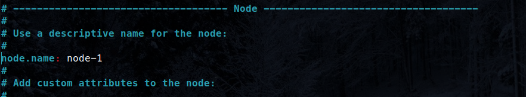
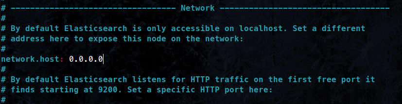
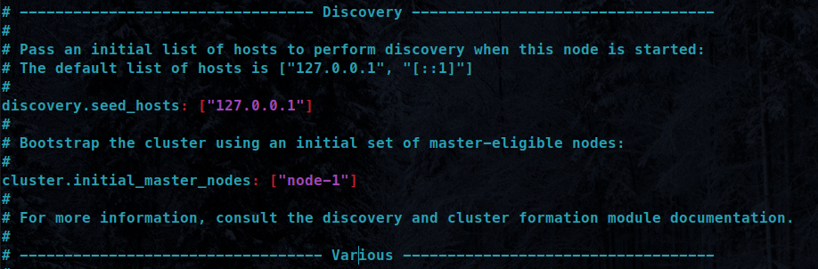

# **ElasticStack Study**


# **Como Utilizar**

Iniciar o container do Ubuntu com o Elasticsearch, utilize o comando:

```bash
make up
```

Para deletar todos os containers, utilize o comando:

```bash
make down
```

Para pausar o container sem destruir, utilize o conmando:

```bash
make stop
```

Caso você precise "re-buildar" o container, pode utilizar o comando:

```bash
make build
```


# **Configurações**

## Configurações do Host

Vamos definir o número máximo de memória na nossa máquina.

PS: Esse comando é para ser executado **na sua máquina** e não dentro do **container**!
```bash
sudo sysctl -w vm.max_map_count=262144
```

* Será necessário executar esse comando todas as vezes que você "reiniciar" o Host. Caso queira deixar esse valor setado permanentemente, siga os comandos:

Abra o arquivo de configurações:

```bash
sudo vim /etc/sysctl.conf
```

Adicione a linha:

```
vm.max_map_count=262144
```

Depois, reinicie as configurações para ser aplicado:

```
sudo sysctl -p
```


## Configurações do Container

Agora vamos fazer as configurações do container.

### Configuração do arquivo elasticsearch.yml

Quando você estiver no container `ubuntu@docker`, você precisa alterar o arquivo de configuração do elasticsearch:

```bash
sudo vim /etc/elasticsearch/elasticsearch.yml
```

Basta alterar da forma que estão nas imagens:





### Incializando o ElasticSearch

Agora vamos inicializar o serviço do elasticsearch e também definir para inicializar junto com o sistema:

```bash
sudo service elasticsearch start && sudo systemctl daemon-reload && sudo systemctl enable elasticsearch.service && sudo systemctl start elasticsearch.service
```

## Testando o ElasticSearch

Vamos testar se o serviço do elasticsearch está rodando:
```bash
sudo service elasticsearch status
```

Você terá uma saída desse tipo:

```bash
* elasticsearch is running
```

Agora vamos testar se o elasticsearch está rodando na porta definida:

```bash
curl -XGET 127.0.0.1:9200
```

Você terá uma saída desse tipo:

```json
{
  "name" : "node-1",
  "cluster_name" : "elasticsearch",
  "cluster_uuid" : "mwTFyOceS-SMwi7aOnn6YQ",
  "version" : {
    "number" : "7.17.6",
    "build_flavor" : "default",
    "build_type" : "deb",
    "build_hash" : "f65e9d338dc1d07b642e14a27f338990148ee5b6",
    "build_date" : "2022-08-23T11:08:48.893373482Z",
    "build_snapshot" : false,
    "lucene_version" : "8.11.1",
    "minimum_wire_compatibility_version" : "6.8.0",
    "minimum_index_compatibility_version" : "6.0.0-beta1"
  },
  "tagline" : "You Know, for Search"
}
```

# **Configurando o Logstash**

Vamos criar o arquivo de configurações do logstash:
```bash
sudo vim /etc/logstash/conf.d/logstash.conf
```

Agora vamos copiar os comandos para dentro do arquivo de configurações do logstash:
```
input {
	file {
		path => "/home/ubuntu/files/access_log"
		start_position => "beginning"
	}
}

filter {
	grok {
		match => {"message" => "%{COMBINEDAPACHELOG}"}
	}
	date {
		match => ["timestamp", "dd/MMM/yyyy:HH:mm:ssZ"]
	}
}
  
output {
	elasticsearch {
		hosts => ["localhost:9200"]
	}
	stdout {
		codec => rubydebug
	}
}
```

Agora, podemos rodar o logstash e os dados contidos no nosso arquivo acess_log serão importados:

```bash
sudo /usr/share/logstash/bin/logstash -f /etc/logstash/conf.d/logstash.conf
```

PS: Quando ele finalizar a importação dos dados, o terminal irá "pausar" pois o Logstash fica aguardando que mais dados sejam enviados. Quando ele estiver pausado, você pode apenas digitar `Ctrl + C` para sair.

Agora, vamos listar os índices criados no nosso Elasticsearch, para encontrar o índice que foi criado pelo Logstash:

```bash
curl -H 'Content-Type: application/json' -XGET 127.0.0.1:9200/_cat/indices?v
```

O índice será algo desse tipo:

PS: A data gerada no nome do índice, será exatamente a data que você executou o arquivo! Então, esse nome com certeza vai estar diferente no momento em que você executar!

```
logstash-2022.09.28-000001
```

Agora, podemos listar os dados do Logstash:

```bash
curl -H 'Content-Type: application/json' -XGET 127.0.0.1:9200/logstash-2022.09.28-000001/_search?pretty
```

Vamos adicionar agora, um arquivo de configuração para o Logstash ler CSV:

```bash
cd $HOME && sudo cp files/csv-read.conf /etc/logstash/conf.d/
```

Agora, podemos executar o Logstash e ler o nosso arquivo de configurações para CSV:

```bash
sudo /usr/share/logstash/bin/logstash -f /etc/logstash/conf.d/csv-read.conf
```

PS: Quando ele finalizar a importação dos dados, o terminal irá "pausar" pois o Logstash fica aguardando que mais dados sejam enviados. Quando ele estiver pausado, você pode apenas digitar `Ctrl + C` para sair.

Agora podemos visualisar os dados do nosso novo índice `demo-csv`:

```bash
curl -H 'Content-Type: application/json' -XGET 127.0.0.1:9200/demo-csv/_search?pretty=true
```

Dentro do nosso diretório temos outro arquivo [csv-read-drop.conf](./files/csv-read-drop.conf), nós temos outro exemplo de configuração do Logstash para leitura de CSV, onde nós realizamos um `mutate` em uma das colunas, convertendo o tipo de dado e também nós definimos que algumas colunas não serão importadas utilizando o `remove_field`. 

Você pode realizar os mesmos procedimentos com esse arquivo e fazer o teste.


Vamos adicionar agora, um arquivo de configuração para o Logstash ler um arquivo JSON:

```bash
cd $HOME && sudo cp files/json-read.conf /etc/logstash/conf.d/
```

Agora, podemos executar o Logstash e ler o nosso arquivo de configurações para CSV:

```bash
sudo /usr/share/logstash/bin/logstash -f /etc/logstash/conf.d/json-read.conf
```

Agora podemos visualisar os dados do nosso novo índice `demo-json`:

```bash
curl -H 'Content-Type: application/json' -XGET 127.0.0.1:9200/demo-json/_search?pretty=true
```

Assim como no exemplo acima com CSV, nesse exemplo nós também criamos um arquivo de configuração de leitura do nosso JSON, removendo alguns campos e filtrando que não queremos importar dados que o pagamento foi realizado via Mastercard, veja o arquivo [json-read-drop.conf](./files/json-read-drop.conf). Para testar, basta realizar os mesmos procedimentos acima!

---


# (Opcional) Criando um "batch ou bash" do comando curl

Caso você não queira ficar digitando o tempo inteiro `curl -H 'Content-Type: application/json'`, nós podemos criar um arquivo em shell e apontarmos o comando curl para execução desse arquivo. Dessa forma, toda vez que você digitar curl, ele vira com o comando completo acima.

Primeiro vamos para o diretório /home e vamos criar um diretório chamado `bin` e entrar nesse novo diretório:

```bash
cd $HOME && mkdir bin && cd bin
```

Agora vamos criar o nosso arquivo bash `curl`:

```bash
echo "!#/bin/bash" >> curl && echo "/usr/bin/curl -H \"Content-Type: application/json\" \"$@\"" >> curl
```

Agora, precisamos mudar a permissão do nosso arquivo e torna-lo executável:

```bash
chmod a+x curl
```

E vamos salvar essas informações no perfil do usuário, para isso precisavos retornar ao diretório home e executar o script de profile:

```bash
cd $HOME && source .profile
```

Podemos agora testar para onde está apontando o comando `curl`:

```bash
which curl
```

A saída deve ser dessa forma: `/home/ubuntu/bin/curl`

Pronto! Agora, toda as vezes que você digitar o comando `curl` no terminal, ele irá executar o comando completo que precisamos, sem precisar informar todas as vezes: `curl -H 'Content-Type: application/json'`, então, podemos simplificar nossa consulta: `curl -XPOST 127...` já com o Header implícito.

---


# Adicionando a Obra de Shakespeare

Vamos "brincar" com o elasticsearch utilizando a obra de Shakespeare.

- Baixando o Schema da obra de Shakespeare:

```bash
sudo wget http://media.sundog-soft.com/es7/shakes-mapping.json
```

- Agora, vamos criar um índice no ElasticSearch chamado `shakespeare` e enviar para ele o nosso Schema:

```bash
curl -H 'Content-Type: application/json' -XPUT 127.0.0.1:9200/shakespeare --data-binary @shakes-mapping.json
```

Você verá uma saída desse tipo:

```bash
{"acknowledged":true,"shards_acknowledged":true,"index":"shakespeare"}
```

Agora, vamos baixar a obra de Shakespeare:

```bash
sudo wget http://media.sundog-soft.com/es7/shakespeare_7.0.json
```

Você verá uma saída desse tipo:

```bash
...
2022-09-23 05:05:10 (10.8 MB/s) - 'shakespeare_7.0.json' saved [25327465/25327465]
```

Agora, vamos enviar a obra de shakespeare, que está descrita no arquivo JSON `shakespeare_7.0.json` para o índice que nós criamos. Esse é o processo de **indexação**.

```bash
curl -H 'Content-Type: application/json' -XPOST '127.0.0.1:9200/shakespeare/_bulk?pretty' --data-binary @shakespeare_7.0.json
```

Vamos fazer uma consulta no índice que acabamos de criar e indexar os dados.

```bash
curl -H 'Content-Type: application/json' -XGET '127.0.0.1:9200/shakespeare/_search?pretty' -d '
  {
    "query":{
      "match_phrase": {
        "text_entry": "to be or not to be"
      }
    }
  }'
```

A saída do comando será algoo dessse tipo:

```json
{
  "took" : 31,
  "timed_out" : false,
  "_shards" : {
    "total" : 1,
    "successful" : 1,
    "skipped" : 0,
    "failed" : 0
  },
  "hits" : {
    "total" : {
      "value" : 1,
      "relation" : "eq"
    },
    "max_score" : 13.889601,
    "hits" : [
      {
        "_index" : "shakespeare",
        "_type" : "_doc",
        "_id" : "34229",
        "_score" : 13.889601,
        "_source" : {
          "type" : "line",
          "line_id" : 34230,
          "play_name" : "Hamlet",
          "speech_number" : 19,
          "line_number" : "3.1.64",
          "speaker" : "HAMLET",
          "text_entry" : "To be, or not to be: that is the question:"
        }
      }
    ]
  }
}
```

# Trabalhando com Banco de Dados de filmes

https://grouplens.org/datasets/movielens/


Altrando o tipo ano para um date:
```bash
curl -H 'Content-Type: application/json' -XPUT 127.0.0.1:9200/movies -d '
{
  "mappings": {
     "properties": {
        "year": {
          "type": "date"
        }
      }
  }
}'
```

Verificando a alteração:

```bash
curl -H 'Content-Type: application/json' -XGET 127.0.0.1:9200/movies/_mapping
```

Vamos adicionar o primeiro filme:

```bash
curl -XPOST 127.0.0.1:9200/movies/_doc/109487 -d '
{
  "genre": ["IMAX","Sci-Fi"],
  "title": "Interestelar",
  "year": 2014
}'
```

Vamos listar todos os filmes:

```bash
curl -XGET 127.0.0.1:9200/movies/_search?pretty
```

Vamos adicionar vários filmes (bulk):

> Para inserir documentos em lote, você utiliza o _bulk.

Inserindo manualmente:

```bash
curl -XPUT 127.0.0.1:9200/movies/_bulk -d '
{ "create" : { "_index" : "movies", "_id" : "135569" } }
{ "id": "135569", "title" : "Star Trek Beyond", "year":2016 , "genre":["Action", "Adventure", "Sci-Fi"] }
{ "create" : { "_index" : "movies", "_id" : "122886" } }
{ "id": "122886", "title" : "Star Wars: Episode VII - The Force Awakens", "year":2015 , "genre":["Action", "Adventure", "Fantasy", "Sci-Fi", "IMAX"] }
{ "create" : { "_index" : "movies", "_id" : "109487" } }
{ "id": "109487", "title" : "Interstellar", "year":2014 , "genre":["Sci-Fi", "IMAX"] }
{ "create" : { "_index" : "movies", "_id" : "58559" } }
{ "id": "58559", "title" : "Dark Knight, The", "year":2008 , "genre":["Action", "Crime", "Drama", "IMAX"] }
{ "create" : { "_index" : "movies", "_id" : "1924" } }
{ "id": "1924", "title" : "Plan 9 from Outer Space", "year":1959 , "genre":["Horror", "Sci-Fi"] }
'
```

Baixando um JSON com essas informações e utilizando para inserir:

wget http://media.sundog-soft.com/es7/movies.json

```bash
curl -XPUT 127.0.0.1:9200/movies/_bulk?pretty --data-binary @movies.json
```

Vamos remover um filme:


Primeiro, vamos pesquisar por algum filme que tenha "Dark", para pegar o seu ID:

```bash
curl -XGET 127.0.0.1:9200/movies/_search?q=Dark
```
```json
{"took":40,"timed_out":false,"_shards":{"total":1,"successful":1,"skipped":0,"failed":0},"hits":{"total":{"value":1,"relation":"eq"},"max_score":1.5169399,"hits":[{"_index":"movies","_type":"_doc","_id":"58559","_score":1.5169399,"_source":{ "id": "58559", "title" : "Dark Knight, The", "year":2008 , "genre":["Action", "Crime", "Drama", "IMAX"] }}]}}
```

Agora, podemos excluir o filme:

```bash
curl -XDELETE 127.0.0.1:9200/movies/_doc/58559
```
```json
{"_index":"movies","_type":"_doc","_id":"58559","_version":2,"result":"deleted","_shards":{"total":2,"successful":1,"failed":0},"_seq_no":7,"_primary_term":2}
```

Agora, se pesquisarmos novamente sobre o filme "Dark":

```bash
curl -XGET 127.0.0.1:9200/movies/_search?q=Dark
```
```json
{"took":967,"timed_out":false,"_shards":{"total":1,"successful":1,"skipped":0,"failed":0},"hits":{"total":{"value":0,"relation":"eq"},"max_score":null,"hits":[]}}
```


# **Outras Formas de Instalar / Configurar o ElasticSearch**

Existem diversas formas de instalar/configurar o ElasticSearch, caso você tenha interesse em instalar de outra forma, diferente do que foi feito nesse repositório nos arquivos [Dockerfile](./Dockerfile) e [docker-compose.yml](./docker-compose.yml).

- [Tutorial de Instalação com o Docker](https://www.elastic.co/guide/en/elasticsearch/reference/7.17/docker.html)


<!-- https://goteleport.com/blog/shell-access-docker-container-with-ssh-and-docker-exec/ -->